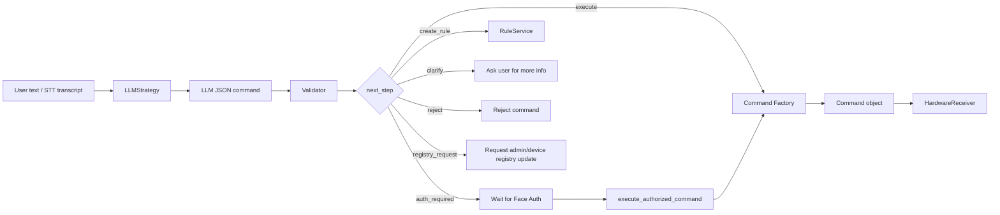

# LLM Command Pipeline, Strategy Pattern, and Command Pattern

This document describes the LLM command-understanding pipeline and the two
main design patterns used in this part of the project: Strategy Pattern and
Command Pattern.

## 1. Pipeline Overview



## 2. Strategy Pattern

| Role | Implementation |
|---|---|
| Strategy interface | `system_core/strategies.py` → `LLMStrategy` |
| Concrete strategy | `modules/llm_integration/llm_strategy.py` → `GeminiLLMStrategy` |
| Mock strategy | `modules/llm_integration/llm_strategy.py` → `MockLLMStrategy` |
| Context | `services/command_service.py` → `CommandService` |

`CommandService` depends on `LLMStrategy`, not directly on Gemini. This allows
the pipeline to switch between Gemini, mock parsing, or future LLM providers
without changing the orchestration logic.

## 3. Command Pattern

| Role | Implementation |
|---|---|
| Command interface | `system_core/commands.py` → `Command` |
| Base command | `system_core/commands.py` → `DeviceCommand` |
| Generic command | `system_core/commands.py` → `GenericDeviceCommand` |
| Special commands | `OpenDoorCommand`, `CloseDoorCommand` |
| Command factory | `create_device_command()` |
| Invoker | `services/command_service.py` → `CommandService` |
| Receiver interface | `system_core/commands.py` → `HardwareReceiver` |

The command factory is capability-driven. Common validated actions use
`GenericDeviceCommand`, while security-sensitive actions such as opening or
closing the main door remain explicit special commands.

## 4. Config-driven Behavior

| Config file | Purpose |
|---|---|
| `config/device_registry.json` | Defines supported rooms, devices, and actions |
| `config/command_schema.json` | Defines required fields, intents, sensors, operators, and sensitive actions |
| `config/language_aliases.json` | Defines Vietnamese aliases for mock parsing |
| `config/device_capabilities.json` | Defines generic/special command behavior and safety policy |
| `modules/llm_integration/prompt_template.txt` | Defines the LLM prompt format |

This design reduces hardcoding. Adding aliases, sensors, operators, or simple
device capabilities should usually require config changes rather than rewriting
parser, validator, or command factory logic.

## 5. Testing

Run all tests from the project root:

```bash
python -m pytest -q
```

Relevant test groups:

```text
tests/llm/       # LLM parsing, prompt, validator, schema-driven behavior
tests/pattern/   # Command Pattern and Strategy Pattern behavior
tests/db/        # Database schema and logging behavior
tests/service/   # Command pipeline and service-level integration
```