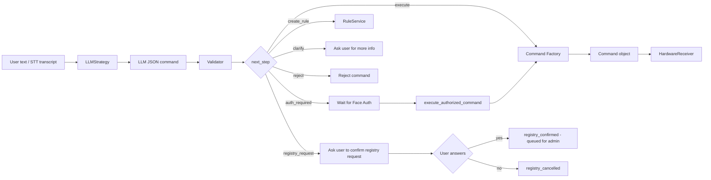

# LLM Command Pipeline, Strategy Pattern, and Command Pattern

This document describes the LLM command-understanding pipeline and the two
main design patterns used in this part of the project: Strategy Pattern and
Command Pattern.

## 1. Pipeline Overview



The Yes/No answer is matched against `config/language_aliases.json` →
`confirmations` **server-side**, before any LLM call. Live `command_log` data
showed the same word `"có"` producing three different outcomes when routed
through the model — a Yes/No reply is structured data, not language needing
interpretation.

## 2. Strategy Pattern

| Role | Implementation |
|---|---|
| Strategy interface | `system_core/strategies.py` → `LLMStrategy` |
| Concrete strategy | `modules/llm_integration/llm_strategy.py` → `GeminiLLMStrategy` |
| Mock strategy | `modules/llm_integration/llm_strategy.py` → `MockLLMStrategy` |
| Context | `services/command_service.py` → `CommandService` |

`CommandService` depends on `LLMStrategy`, not directly on Gemini. This allows
the pipeline to switch between Gemini, mock parsing, or future LLM providers
without changing the orchestration logic.

## 3. Command Pattern

| Role | Implementation |
|---|---|
| Command interface | `system_core/commands.py` → `Command` |
| Base command | `system_core/commands.py` → `DeviceCommand` |
| Generic command | `system_core/commands.py` → `GenericDeviceCommand` |
| Special commands | `OpenDoorCommand`, `CloseDoorCommand` |
| Command factory | `create_device_command()` |
| Invoker | `services/command_service.py` → `CommandService` |
| Receiver interface | `system_core/commands.py` → `HardwareReceiver` |

The command factory is capability-driven. Common validated actions use
`GenericDeviceCommand`, while security-sensitive actions such as opening or
closing the main door remain explicit special commands.

## 4. Server-side Safeguards

The pipeline does not trust the LLM output as-is. Five checks run server-side
between the model response and execution — see `Design-Principles.md` §1.

| Function | Guards against |
|---|---|
| `validator.enforce_policy()` | LLM claiming `face_auth=false` on a sensitive action, or `true` on a harmless one |
| `llm_module.ground_slots()` | LLM inventing slot values the user never said |
| `llm_module.drop_inherited_conflict()` | context merging producing an impossible (room, device) pair |
| `llm_module.detect_unsupported_room()` | inconsistent handling of rooms that exist in aliases but not in the registry |
| `llm_module.failure_response()` | a failed command being reported in success language |

**Slot grounding** is the one with hardware consequences. A value for `room` or
`device` is accepted only if the user's utterance contains evidence for it —
matched against `language_aliases.json` — or if it was inherited from the
previous turn. Observed before the guard existed:

```
Bot : Nhà bếp chưa được đăng ký. Bạn có muốn gửi yêu cầu không?
User: có
Bot : Đã bật đèn phòng ngủ.          <- hardware actually actuated
```

Dropped slots are recorded in `error_log` under `security_policy`, so model
drift leaves an audit trail rather than passing silently.

**`failure_response()`** exists because `command["response"]` is written by the
LLM *before* the server validates. Reusing it on the failure path meant the log
recorded `execution_status="failed"` while the user heard *"Đã bật đèn ở cửa
chính."*

## 5. Config-driven Behavior

| Config file | Purpose |
|---|---|
| `config/device_registry.json` | Defines supported rooms, devices, and actions |
| `config/command_schema.json` | Defines required fields, intents, sensors, operators, and sensitive actions |
| `config/language_aliases.json` | Defines Vietnamese aliases for mock parsing |
| `config/device_capabilities.json` | Defines generic/special command behavior and safety policy |
| `modules/llm_integration/prompt_template.txt` | Defines the LLM prompt format |

This design reduces hardcoding. Adding aliases, sensors, operators, or simple
device capabilities should usually require config changes rather than rewriting
parser, validator, or command factory logic.

## 6. Testing

Run all tests from the project root:

```bash
python -m pytest -q
```

Relevant test groups:

```text
tests/llm/            # LLM parsing, prompt, validator, schema-driven behavior
tests/modules/llm/    # slot grounding, suggestions, failure responses, registry confirmation
tests/modules/face/   # Face module contract (offline, no dlib needed)
tests/services/       # AuthService (offline, no database needed)
tests/pattern/        # Command Pattern and Strategy Pattern behavior
tests/db/             # Database schema and logging behavior
tests/service/        # Command pipeline and service-level integration
```

The whole suite runs offline: no dlib, no webcam, no microphone, no API key, no
hardware. See `Design-Principles.md` §5 for the three techniques that keep it
that way.

## 7. Measurement

`tools/measure_llm.py` runs a **fixed** set of 13 scenarios (33 utterances)
against either engine and prints a summary:

```bash
python -m tools.measure_llm --tag after --out measure_after.txt
python -m tools.measure_llm --tag after --delay 5 --out measure_gemini.txt   # Gemini free tier: 15 req/min
```

The scenario list is fixed on purpose. Typing 33 commands by hand twice never
produces the same input twice, which makes before/after comparison meaningless.

Three figures the tool computes:

| Figure | Meaning |
|---|---|
| Distribution by `execution_status` + mean latency | the main table for the evaluation chapter |
| Rows marked failed but recorded as success | must be **0** |
| Model-drift entries in the audit log | how often the model invented a slot or violated policy |